# GateXPay Chatbot — End-to-End Answer Flow Diagram

The diagram below maps the actual runtime execution flow of a user message through the GateXPay chatbot architecture, derived from static code inspection and live runtime execution evidence.

```mermaid
flowchart TD
    classDef client fill:#E0F2FE,stroke:#0284C7,stroke-width:2px,color:#0F172A;
    classDef gate fill:#FEF3C7,stroke:#D97706,stroke-width:2px,color:#0F172A;
    classDef process fill:#F1F5F9,stroke:#64748B,stroke-width:2px,color:#0F172A;
    classDef provider fill:#F3E8FF,stroke:#9333EA,stroke-width:2px,color:#0F172A;
    classDef exit fill:#DCFCE7,stroke:#16A34A,stroke-width:2px,color:#0F172A;
    classDef alert fill:#FEE2E2,stroke:#DC2626,stroke-width:2px,color:#0F172A;

    subgraph UI ["1. Client Frontend (components/common/Chatbot/Chatbot.jsx)"]
        UserAction(["User enters message / clicks suggestion chip"]):::client
        FormCheck{"Is input non-empty & not loading?"}:::gate
        AppendUserMsg["Append user message to React state (messages)"]:::process
        SendFetch["POST /api/chat with { messages: [history, userMsg] }"]:::process
    end

    subgraph API ["2. Backend Router (app/api/chat/route.js)"]
        ReceiveReq["Receive POST /api/chat"]:::process
        RL_Check{"Rate Limiter Check\n(chatRateLimiter.isRateLimited(ip))\nLimit: 15 req/min"}:::gate
        RL_Fail["HTTP 429: Too many requests. Please wait a moment." ]:::alert
        
        ValidateBody{"Messages array valid\n& latest message role == 'user'?"}:::gate
        BodyFail["HTTP 400: Invalid payload"]:::alert
        
        SecCheck{"Lead Security Check\n(checkLeadSecurity)\nCard / CVV / PIN / OTP?"}:::gate
        SecWarning["Return HTTP 200: Security Warning\n(Refusal to accept credentials)"]:::alert

        NormQuery["Normalize Query & Detect Language\n(normalizeQuery: English / Hindi / Hinglish)"]:::process
        BuildCtx["Build Context from History (last 4 msgs)\n(buildConversationContext: topic / platform / type)"]:::process

        CacheCheck{"In-Memory Cache Lookup\n(chatCache.get(normalizedKey))"}:::gate
        CacheHit["Return HTTP 200 from Cache\n(5-min TTL entry)"]:::exit

        ScopeCheck{"Evaluate Scope\n(evaluateScope)"}:::gate
        PromptInj["Return HTTP 200: Prompt Injection Refusal\n(Redirect to GateXPay services)"]:::alert
        OutOfScope["Return HTTP 200: Out-of-Scope Refusal\n(Disallowed external topic redirect)"]:::alert

        IntentDetect["Intent Detection (18 rules)\n(detectIntent: rule keywords + context fallback)"]:::process
        KBRetrieve["Knowledge Retrieval (19 verified items)\n(retrieveKnowledge: exact, title, intent, kw scoring)"]:::process
        GenFollowUps["Follow-Up Generator\n(generateFollowUps: 3 deterministic chips)"]:::process
    end

    subgraph AI_ORCHESTRATION ["3. Provider Orchestration (lib/chatbot/providers/index.js)"]
        CallProviders["Try generateWithProviders()"]:::process
        GeminiCheck{"Gemini Configured?\n(GEMINI_API_KEY)"}:::gate
        GeminiCall["Call Gemini API (gemini-2.0-flash)\nMax attempts: 3 (exp backoff)"]:::provider
        Gemini404{"HTTP 404:\nModel no longer available"}:::alert

        GroqCheck{"Groq Configured?\n(GROQ_API_KEY)"}:::gate
        GroqSkip["Skipped (Key Missing)"]:::process

        OpenRouterCheck{"OpenRouter Configured?\n(OPENROUTER_API_KEY)"}:::gate
        OpenRouterSkip["Skipped (Key Missing)"]:::process

        AzureCheck{"Azure Configured?\n(AZURE_OPENAI_API_KEY)"}:::gate
        AzureSkip["Skipped (Key Missing in .env.local)"]:::process

        ProviderSuccess{"Any Provider\nReturned Valid Message?"}:::gate
        
        OutputValidate{"Validate AI Response\n(validateResponse)\nNo ** bold, no tables, no bank claims,\nno 99.99% stat, no leaks"}:::gate
        OutputSanitized["Sanitize & Cache Response\n(chatCache.set(5 min))\nReturn HTTP 200 AI Response"]:::exit
    end

    subgraph LOCAL_FALLBACK ["4. Local Deterministic RAG Fallback (app/api/chat/route.js)"]
        ConfidenceCheck{"retrieval.hasStrongMatch?\n(confidence >= 0.75 or\nconfidence >= 0.50 with activeTopic)"}:::gate
        Clarification["Return HTTP 200 Clarification Response:\n'Could you clarify whether you are asking about...'"]:::exit
        LocalRAG["generateFallbackResponse():\nExtract bestMatch.item.answer directly\nfrom gatexpayKnowledgeBase"]:::exit
    end

    subgraph RENDER ["5. UI Display (Chatbot.jsx)"]
        ParseMarkdown["Parse line items, ordered/unordered lists\n(MsgContent lightweight renderer)"]:::process
        RenderChat["Display assistant bubble + 3 suggestion chips"]:::client
    end

    %% Connections
    UserAction --> FormCheck
    FormCheck -- Yes --> AppendUserMsg --> SendFetch --> ReceiveReq
    FormCheck -- No --> UserAction

    ReceiveReq --> RL_Check
    RL_Check -- Blocked (>= 15/min) --> RL_Fail --> RenderChat
    RL_Check -- Allowed --> ValidateBody

    ValidateBody -- Invalid --> BodyFail --> RenderChat
    ValidateBody -- Valid --> SecCheck

    SecCheck -- Sensitive Data Found --> SecWarning --> RenderChat
    SecCheck -- Safe --> NormQuery --> BuildCtx --> CacheCheck

    CacheCheck -- Hit --> CacheHit --> RenderChat
    CacheCheck -- Miss --> ScopeCheck

    ScopeCheck -- Prompt Injection --> PromptInj --> RenderChat
    ScopeCheck -- Out of Scope --> OutOfScope --> RenderChat
    ScopeCheck -- In Scope / Uncertain --> IntentDetect --> KBRetrieve --> GenFollowUps --> CallProviders

    CallProviders --> GeminiCheck
    GeminiCheck -- Yes --> GeminiCall --> Gemini404 --> GroqCheck
    GeminiCheck -- No --> GroqCheck
    GroqCheck -- No --> GroqSkip --> OpenRouterCheck
    OpenRouterCheck -- No --> OpenRouterSkip --> AzureCheck
    AzureCheck -- No --> AzureSkip --> ProviderSuccess

    ProviderSuccess -- Yes --> OutputValidate
    OutputValidate -- Valid --> OutputSanitized --> RenderChat
    OutputValidate -- Failed --> ConfidenceCheck

    ProviderSuccess -- No (All Failed / Unconfigured) --> ConfidenceCheck
    ConfidenceCheck -- No Strong Match --> Clarification --> RenderChat
    ConfidenceCheck -- Strong Match Found --> LocalRAG --> RenderChat
```

---

## 3. Key Observations from the Call Graph

1. **Complete Database Bypassing**: At no point in the entire pipeline is `mongoose`, `db`, or any MongoDB collection ever touched. Customer orders, admin accounts, and contact enquiries cannot be accessed or manipulated.
2. **Deterministic Primary Fallback**: Because `gemini-2.0-flash` returns HTTP 404 and secondary providers lack API keys in `.env.local`, the branch consistently falls over from `CallProviders` directly down to `ConfidenceCheck` -> `LocalRAG`.
3. **Triple Security Filtering**: The input passes through `checkLeadSecurity` (sensitive data regex), `evaluateScope` (prompt injection & out-of-scope keywords), and `validateResponse` (output compliance sanitizer).
